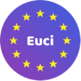
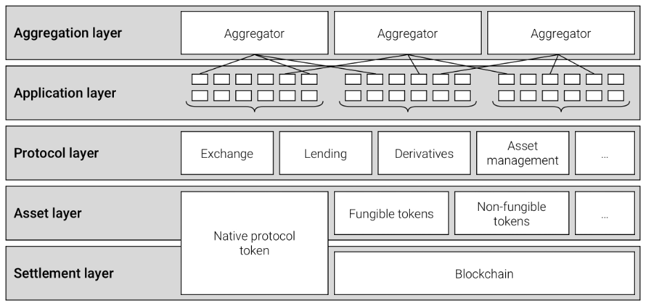
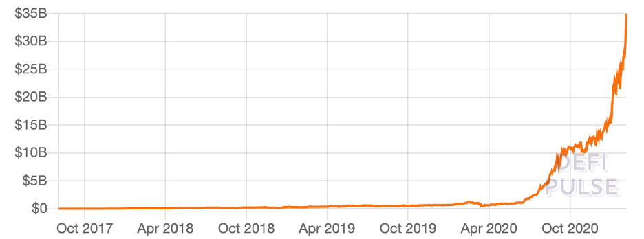
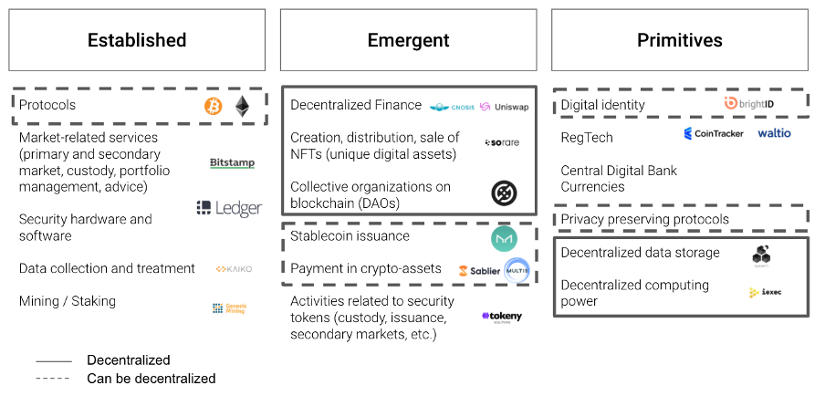
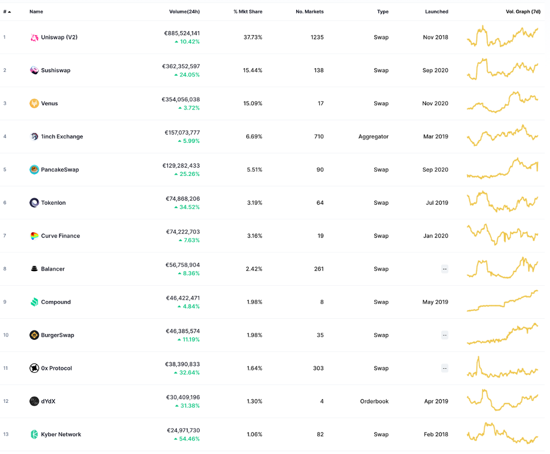
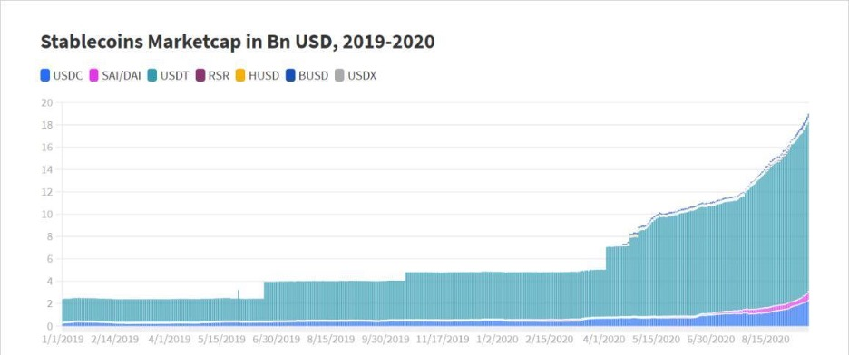
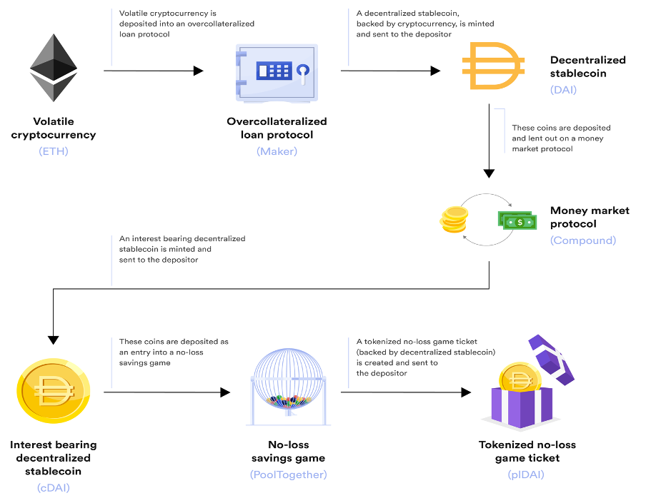
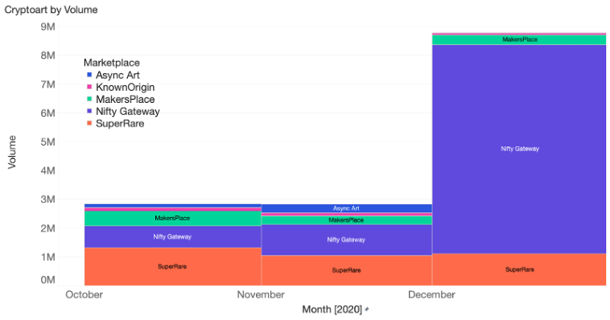
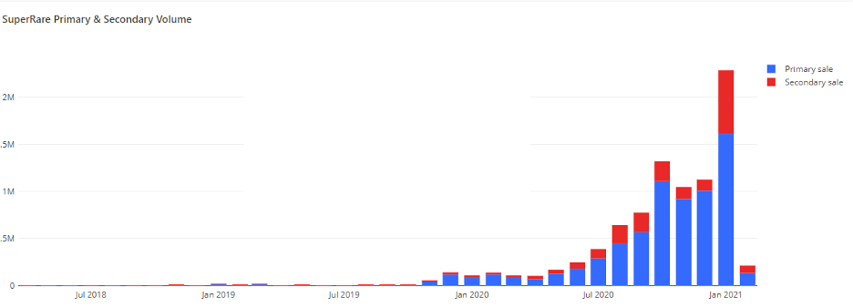

# Why Europe needs to get on the front foot on financial innovation


## <p style="text-align: right">
February 25, 2021 \
<em>EU Crypto Initiative</em></p>

## Executive summary

The speed of innovation and corresponding technological development in the crypto-assets market is unmatched by any other specialised field today, even AI. Every week, we observe novel concepts around digital representations of money or value, peer-to-peer exchange and decentralised market infrastructure.

**Exponential growth in the Decentralised Finance (DeFi) space since April 2020, with total assets under management reaching 40b USD to date**[^1]**, heralds the emergence of a global Internet of Money:**

* The emergence of new token categories and market places, e.g. digital art or CO2 certificates with significant values created and exchanged;
* DeFi  projects already produce some of the most significant crypto assets today (e.g., AAVE, YFI, DAI, COMP);
* Innovative financing and operating mechanisms for decentralised protocols are being created (token distribution mechanisms as liquidity mining, reversible ICOs, bonding curves, decentralised organisations etc.) with increasingly significant numbers of participants.

While still in its infancy, the significant rise in demand for DeFi applications means that the sector is only going to continue to grow.  

The political significance of this development is that open blockchain networks hold the genuine potential to:


* Support Europe’s Capital Markets Union ambitions in making financial services more accessible, more transparent, more diverse, more liquid and more inclusive.
* Enhance the euro’s competitiveness by challenging the US Dollar’s growing dominance as the reserve currency of choice in the stablecoins space (see our Stablecoin paper). 
* Support the digital transition with significant long-term positive impact on job creation and economic growth[^2].


* Provide new innovative ways of supporting the climate and energy transition, as well as supply chain tracking.
* Create a strong EU Single Market in crypto-assets, supported by a regulatory framework where both centralised and decentralised use cases can co-exist and play their role in making Europe more digitally competitive.
* Even support some sectors severely hit by COVID-19, such as the arts sector, where through DeFi technology, specific applications have allowed for cultural experiences online and provided creators with the opportunity to share art and interact directly with an enthusiastic community of collectors.

The proposed Market in Crypto Assets Regulation (MiCA) provides a historic opportunity to deliver these political objectives. MiCA could become the global standard of reference that brings the desired legal clarity to established centralised actors in crypto-asset markets while allowing the more innovative decentralised use cases to continue experimenting and growing in a controlled fashion.

However, the Commission proposal does not arrive at this balance. MiCA regulates all crypto-assets regardless of whether they are of a decentralised nature. Meanwhile, it imposes compliance requirements that only well-funded companies may fulfil, effectively prohibiting innovative decentralised projects from emerging in the European market.

Three conditions are needed to transform MiCA from a threat to innovation into an opportunity for Europe to thrive in the emerging crypto-finance market.


* **It is incumbent on the DeFi sector to articulate the value add of decentralised use cases using public blockchain technologies.** For example, DeFi innovations around algorithmically allocating and managing liquidity will lead to new financing models for alternative forms of value creation with tangible impacts on the economy. In the annexe, we provide further examples of DeFi use-cases. Large-scale incentive networks tied to real-world information will fuel global change in the 21st-century information economy at a macro level.
* **It is incumbent on EU policy-makers to seize the moment and accompany the innovation in the crypto-asset sector.** By shutting itself off from the evident macro trends in DeFi development, Europe endangers its long-term stability and leadership position instead of embracing them. Decentralised use cases challenge the traditional approach to regulation, and therefore the benefits that one would expect regulation to achieve: more investments, more growth, more mainstream adoption. In the case of DeFi, the effects of the current MiCA would be the exact opposite: EU companies and talent would leave Europe due to unsatisfiable compliance requirements and less investment by investors in EU companies. Any significant adoption of these technologies at the retail level would benefit actors operating in favourable jurisdictions, such as the US and Asia. One cannot help but see parallels with the EU’s position on sovereignty and market dominance as it relates to FAANGs.
* **It is incumbent on both the DeFi sector and EU policy-makers** to work together to ensure that the risks associated with DeFi use-cases are fully identified, understood and addressed in a manner that reflects the specificities of this fast growing decentralised universe. We are currently working on such a risk-mapping exercise.

The rest of this paper is structured as follows: 


* Recognising the complexity of the matter, we first seek to explain DeFi. 
* Far from arguing against the need to appropriately regulate DeFi, we then consider:
    * How MiCA could be adapted to ensure that it does not hinder the development of DeFi use cases, notably through introducing the concept of “effective control” exerted by a centralised entity. 
    * How the European Union can shift to develop the most innovative, advanced regulation for DeFi use cases in the world, with key elements that such a regulatory framework should contain.
* Annexed to this paper, we provide a detailed description of the most representative examples of DeFi use cases.


## What is DeFi?

DeFi is often described as “lego for money”. This refers to the highly composable nature of DeFi services, which stems from the technological approach underpinning them. The schematic below describes the multi-layered architecture of DeFi. These layers work together to create a decentralised service interface for end-users and application developers (schematic and model adapted from Schär research[^3]). 




**It is important to understand that none of these layers can be adequately captured by traditional regulation means. **The settlement layer allows the network to store ownership information securely and ensures that all transactions are compliant with a shared set of rules. The asset layer consists of smart contract-based asset registries, where crypto assets are minted and transacted. The protocol layer provides smart contract-based market infrastructure such as decentralised exchanges, debt markets, derivatives, and asset management. The application and aggregation layers create user-oriented applications accessible through a web browser-based front end. Aggregators create user-centric platforms that connect to several applications and protocols. They usually provide tools to compare and rate services, allow users to perform otherwise complex tasks by connecting to several protocols simultaneously, and combine relevant information clearly and concisely.

**Today, DeFI applications are still a niche part of the crypto-assets ecosystem in terms of trading volumes and market capitalisations. Yet, it is the most active in terms of innovation.** We witness the emergence of a fully decentralised financial ecosystem that mimics traditional finance. However, it allows for entirely new interconnections and operations, pooling of liquidity, exchanging different representations of value and much more. The exponential growth currently underway in that sector bears witness to the power of genuinely permissionless innovation. It results from the hundreds of thousands of individuals and companies innovating on a transparent and shared, globe-spanning ledger.

DeFi projects have seen fast growth in the last few months, reaching more than EUR 45 billion in assets under management[^4].

Total value locked in DeFi protocols:




Despite the exponential growth currently witnessed in the DeFi market, European regulators show little awareness of this groundbreaking development. Instead, topics like tokenisation of securities, Central Bank Digital Currencies (CBDC), and preventing Facebook’s Libra/Diem project dominate the conversation. Although these are undoubtedly important issues, they are far from representative of the market reality. Meanwhile, U.S. regulators are seizing the opportunity and encouraging the DeFi market’s growth by issuing an official statement, legalising US commercial banks’ settlement of transactions based on private stablecoins.[^5] Not least because most of these stablecoins are pegged to the dollar.[^6]

Similarly, in the UK, the recent public consultation on stablecoins & crypto-assets launched by the FCA[^7] signals an intention to find ways to increase the competitiveness of UK crypto-assets companies in a post-Brexit environment. GBP stablecoins will likely be favoured, with the same private-focused strategy as the US.

## How to deal with DeFi use cases in MiCA

At this stage in the process, the reasonable way forward is to adapt MiCA to ensure that the text does not hinder DeFi use cases. We favour introducing the concept of “effective control” exerted by a centralised entity. Concretely, this means that MiCA’s regulatory scope should focus on cases where an issuer or service provider retains the power to unilaterally issue, execute or indefinitely prevent a crypto-asset transaction. In cases where an asset’s legal issuer or controlling entity cannot be identified, obligations should be adapted, notably white paper obligations.


### Proposal 1: Ensure that issuance obligations are adapted to decentralised finance and applied to legal entities controlling and benefiting from the assets

The main distinction between centralised and decentralised use cases is the degree of control that the product’s creator retains. This specificity has to be taken into consideration in the regulation.

Therefore, it should be made clear that only crypto-assets or products **effectively controlled**[^8] by legal persons are subject to MiCA rules regarding issuance and trading of crypto-assets (including asset-referenced tokens and e-money tokens). 

**Effective control in this sense should refer to the power to unilaterally issue, execute or indefinitely prevent a crypto-asset transaction**[^9]**.**

Crypto-assets whose control is distributed should not be subject to the same obligations. However, to ensure adequate consumer and investor protections, entities listing tokens on a CASP (the **‘offerer**’) should be subject to information and transparency requirements. Such obligations, which may take inspiration from the white paper, should be adapted due to the specific nature of the assets considered.

Regarding asset-referenced and e-money tokens, a new “_algorithmic tokens_”[^10] category should be exempted from MiCA. Those stablecoins are defined as those for which the issuer has no control over the reserve assets and would consequently be incapable of complying with MiCA's obligations.

```
Proposal: 

Amend the definition of "'issuer of crypto-assets" in MiCA, article 3 to remove "or seeks the admission of such crypto-assets to a trading platform for crypto-assets".
Define "effective control" in MiCA, article 3 as "the power to unilaterally issue, execute or indefinitely prevent a crypto-asset transaction on a DLT"
Define "algorithmic tokens" in MiCA, article 3 as "a type of crypto-asset that purports to maintain a stable value where the issuer has no effective control on the issuance rules or the reserve assets, where applicable"
Complete MiCA, article 15§3 with a c) "the issuer has no control over the reserve assets of asset-referenced tokens"
Complete MiCA, article 43§2 with c) "algorithmic tokens"
```

### Proposal 2: Allow exchanges to list all relevant assets, irrespective of the applicability of whitepaper obligations

Trading platforms should be allowed to freely list all tokens, including DeFi tokens, which  the current drafting of MiCA, article 86§1 subparagraph 10, does not appear to allow.

Within article 68§1, the requirements set are sufficient to ensure that trading platforms will list only crypto-assets on which they have done the necessary due diligence. Any other limitation would appear unnecessary.   


```
Proposal: Remove MiCA, article 68§1, Subparagraph 10
"For the purposes of point (a), the operating rules shall clearly state that a crypto-asset shall not be admitted to trading on the trading platform, where a crypto-asset white paper has been published, unless such a crypto-asset benefits from the exemption set out in Articles 4(2).
```

### Proposal 3: Allow CASPs to offer services on decentralised assets

Crypto-assets whose control is distributed between their users - and not exercised by a single legal entity – should not be subject to the prohibitions and/or restrictions that MiCA establishes regarding the issuance and trading of crypto-assets. This would allow CASPs to freely provide services on such assets.


```
Proposal: Adapt MiCA, Title V (articles 43 to 75) to remove any limitations to the activities of CASPs regarding decentralised crypto-assets.
```

## Towards regulating Decentralised Markets in Crypto Assets (DeCA)

Once MiCA has been adjusted to properly focus on centralised use cases only, we recommend that European institutions shift to developing the most innovative, most advanced regulation for DeFi use cases in the world. By doing so, Europe can become the clear leader in this emerging field and offer a global standard that can compete with other jurisdictions, including the U.S., which has already started to head in that direction.


### I. Legitimise and secure independent node verification networks

Thanks to emerging DeFi use cases, open blockchain networks prove to be the most significant innovation brought about by distributed ledger technology. While Europe has yet to recognise this essential fact, the U.S. is already a step ahead. In January 2021, the Office of the Comptroller of the Currency published a letter clarifying national banks’ and federal savings associations’ authority to participate in independent node verification networks (INVN) and use stablecoins to conduct payment activities and other bank-permissible functions.[^11]

Europe is faced with an opportunity of historical proportions: to recognise and legalise the use of open blockchain networks by regulated financial institutions and participate in securing these networks. By securing positions as significant network validators operating under a clear legal framework, European companies can play an essential role in the governance and future evolution of the underlying protocols, such as Bitcoin, Ethereum and other significant networks.

### II. Leverage digital identity to co-innovate and co-regulate DeFi applications

A key element in regulating a decentralised mesh of services that are controlled by their users rather than by any centralised service provider is the concept of digital identity. The European Blockchain Partnership (EBP) has already started to draft a European self-sovereign digital identity framework (eSSIF), using Europe’s own public services infrastructure (EBSI). Once the eSSIF framework is ready for broader usage, DeFi applications can start to incorporate those verified identities into their service infrastructure. Solving the identity issue would provide a major competitive advantage to DeFi applications in Europe, while giving European regulators a tool to enforce KYC/AML obligations, taxation and market oversight.


### III. Introduce a legal framework for Distributed Autonomous Organisations (DAOs)

The second pillar of regulating DeFi applications is providing a tailor-made framework for the legal personality of Distributed Autonomous Organisations (DAOs). Today, DAOs are the most popular way to deploy DeFi applications on open blockchain networks while handing control over future updates of the decentralised smart contract infrastructure to token holders. Yet, DAOs do not enjoy any form of legal recognition in Europe nor anywhere else in the world. Developing a framework for DAOs as collective management bodies of stakeholders presents a massive opportunity that Europe should grasp. Much like with digital identities, such an infrastructure would nurture the DeFi ecosystem while establishing regulatory reach in that arena.

## Appendix

### Building blocks and emerging use cases in DeFi

Although it is impossible to convey the breadth of use cases enabled by permissionless innovation currently underway in the DeFi ecosystem, below are several representative examples of such use cases.

#### DeFi Use Cases

Below is a high-level picture of centralised and decentralised use cases from the most established to the most innovative use cases.




**I. Decentralised Exchanges (DEX) – Market infrastructure without intermediaries**

Decentralised exchanges (DEX) are a type of cryptocurrency exchange which allow for direct peer-to-peer cryptocurrency transactions to take place online securely and without the need for an intermediary. In transactions made through DEX, the typical third-party entities which would normally oversee the security and transfer of assets (e.g. banks, stockbrokers, online payment gateways, government institutions, etc.) are substituted for a blockchain or distributed ledger. Some common methods of operation include the use of smart contracts or order book relaying, although many other variations are possible with differing degrees of decentralisation. A DEX can still have centralised components, whereby some control of the exchange remains in the hands of a central authority. A notable example being IDEX blocking New York State users from placing orders on the platform.

The main benefit of DEXs is their trustless nature. A trustless system means that the participants involved do not need to know or trust each other or a third party for the system to function. In a trustless environment, there is no single entity that has authority over the system, and consensus is achieved without participants having to know or trust anything but the system itself. Users don’t have to lose custody of their funds while still being able to trade and exchange their digital assets.

Some of the most popular DEXs and aggregators by trade volume (Feb 4th 2021)


 \

**II. Algorithmic Market Makers (AMMs) – facilitating liquidity provision and reducing cost of trading**

In many markets, there may not be enough organic liquidity to support active trade. Market makers are agents that alleviate this problem by facilitating trade that would otherwise not occur in those markets. “Automated market makers” (AMMs) are algorithmic agents that perform those functions and, as a result, provide liquidity in electronic markets.[^12] Because AMMs encourage passive market participants to lend their assets to pools, they make liquidity provisioning an order-of-magnitude easier. Traditionally, bootstrapping liquidity in an order-book-based exchange is an extremely tedious and expensive process. 

Concretely, AMMs are defined as a protocol or an application that utilises a math function to determine the price of an asset and subsequently facilitate the exchange of two or more assets.[^13] The most famous example of an AMM is Uniswap, a decentralised exchange (DEX) that utilises a constant function of x*y=k to conduct token swaps.

Since Bancor introduced on-chain AMMs in 2017, there have been several notable improvements on different aspects of AMMs:

* Uniswap (2018): first AMM to achieve meaningful volumes and kickstart the AMM wave in DeFi - largely because of its simplicity.
* Curve (2019): first AMM optimised for stable asset baskets.
* Balancer (2020):  first AMM to enable liquidity pool creators to customise weights between two or more assets in the single pool.
* Bancor V2 (2020): first AMM to introduce dynamic weights for liquidity pools by realising the losses by Bancor LPs to mitigate impermanent loss. Bancor also lets you provide only one side of the liquidity to the pool.
* Blackholeswap (2020): first AMM to process transactions exceeding its existing liquidity by tapping into the excess supply on Compound or other lending protocols.

**III. Synthetic assets - Tracking real world assets in a fully decentralised fashion**

The concept of synthetic asset refers to a collection of assets that have the same value as another asset.[^14] Traditionally, synthetic products combine various derivatives — options, futures, or swaps — that mimic the underlying asset — stocks, bonds, commodities, indices, currencies, or interest rates. Crypto synthetic assets aim to provide users with access to many different assets without having to hold the underlying asset. This can be anything from fiat currencies like the US dollar or Japanese yen, to commodities like gold and silver, as well as index funds or other digital assets. By using these unique synthetic assets, investors can own tokens that track the value of certain assets without having to leave the cryptocurrency ecosystem. Cryptocurrency synthetic assets also offer users all the benefits of decentralization, as they are open to all users abroad using secure smart contracts and other tools, and the data is stored in distributed ledgers.

**III. Stablecoins - Many ways to build a peg with DeFi**

Stablecoins have unlocked much of the innovation happening in DeFi today. They can be sub-divided into three categories: collateralised by U.S. Dollars, over-collateralised by multi-asset pools, and algorithmic.[^15] Stablecoins in the first category—namely USDT and USDC, but also exchange-based tokens like BUSD—are centrally managed, backed by, and redeemable one-to-one for, U.S. Dollars. These stablecoins have the advantages of an assured peg and capital efficiency (i.e. no over-collateralisation), but their permissioned, centralised nature means that users can be banned and the peg itself is dependent on the trustworthy behavior of the central entity. 




The second category, multi-asset collateralised stablecoins, includes MakerDAO’s DAI and Synthetix’s USD. Both of these stablecoins are over-collateralised by crypto-assets, and rely on price oracles to maintain the peg to the U.S. Dollar. Unlike centralised tokens like USDT and USDC, these can be minted permissionlessly, although in DAI’s case, it is worth noting that permissioned, centralised assets like USDC can be used as collateral. Moreover, the over-collateralised nature of these stablecoins means that they are extremely capital-intensive, and the highly-volatile, hyper-correlated nature of crypto assets have rendered these stablecoins vulnerable to crypto-wide shocks in the past.

An algorithmic stablecoin is a token that adjusts its supply deterministically (i.e. using an algorithm) in order to move the price of the token in the direction of a price target. At the most basic level, an algorithmic stablecoin expands its supply when it is above the price target and contracts when it is below. Unlike the other two types of stablecoins, algorithmic stablecoins are neither redeemable one-to-one for U.S. dollars, nor backed by crypto-asset collateral. Finally, and perhaps most importantly, algorithmic stablecoins are often highly reflexive: demand is driven in large part—and critics might argue, exclusively—by market sentiment and momentum. These demand-side forces are transposed into the token supply, which in turn generates further directional momentum in what can eventually become a violent feedback loop.

**IV. Decentralised Lending - Positive interest deposit accounts are real in DeFi**

Crypto holders can lend on decentralised lending platforms to earn passive income on their holdings through interest fees paid by borrowers.[^16] This is an attractive option to lenders as they can earn relatively low risk interest on their existing holdings without entrusting their private keys to a 3rd party centralised service.

Currently, all relevant decentralised lending platforms use a form of borrowing called collateralised borrowing, meaning that borrowers must lock up collateral of greater value than the value of their borrow. The collateral serves to ensure lenders will be repaid even if the borrower never repays the loan.

MakerDAO is the most widely used decentralised lending platform today. MakerDAO is the creator of DAI, which is a cryptocurrency with a target price of $1 (known as a stablecoin). On MakerDAO, there are no lenders, and the only asset available to borrow is DAI. Borrowers can borrow a newly created supply of DAI by locking up ETH as collateral, and must maintain a 150% collateralisation ratio. The interest rate on DAI is global, and is set through governance by MKR token holders. The interest rate has recently been fairly volatile, increasing from 2.5% to 19.5% in a bit over a month.

Compound is another lending platform, that uses a money market based approach, with global pools of capital for each supported asset. Each asset has a global borrow and lend interest rate which all borrowers pay and lenders earn. These interest rates are variable and set algorithmically based on the percentage of each pool that is being borrowed. Borrowers must collateralise their accounts with 150% of the value being borrowed. For example, if you want to borrow 1 ETH from Compound, you could deposit 225 DAI into the Compound DAI pool and then borrow 1 ETH from the ETH pool (assuming 1 ETH = 150 DAI — this would be 150%).

**V. DeFI Apps leveraging composability and interoperability - Lego for money**

Composability is often cited as the reason behind the exponential growth of DeFi. Financial “money legos” enable products and services to interlock permissionlessly, which expands the innovation vector outside of a siloed company.[^17] Each individual DeFi app “Lego brick” is a specific financial product or service that can be freely combined with others.[^18] A new DeFi app may combine many of these specific-purpose Lego-brick products and services into an offering that is even more powerful or customised to specific user needs. Importantly, these Legos are clicked together for each individual transaction, on the fly. This enables a level of flexibility and innovation that is unthinkable with traditional financial systems that are locked up behind the (fire)walls of banks.

Yearn Finance is an open-source, decentralised finance (DeFi) lending protocol based on the Ethereum blockchain. It works as a yield aggregating platform to maximise the user's investment by automatically moving the user funds between DeFi lending protocols, such as Compound, Dydx, Curve, or Aave. This project highlighted a simple but highly valuable form of composability: automated investment across multiple other DeFi apps that provide various returns on staked tokens. The Yearn app uses the fact that it can instantly (atomically) check the current return on investment for these other apps through open interfaces, and automatically move its pool of investment to wherever it will be most profitable. From the user’s perspective, they can treat Yearn like a managed investment fund where they put in tokens and get returns without any further thought. But unlike with traditional finance , this “fund manager” is transparent, cheap, and responds instantly.

Flash loans are a concept invented in the DeFi world because it simply wasn’t possible before – and is a good example of atomic composability. Aave is a token lending platform. Normally borrowing means locking some collateral (in the form of other tokens) to get a loan. However Aave also provides a “flash loan” option where you can borrow tokens without collateral – as long as you return them in the same transaction (so there is no risk of default). You only pay a fee for the privilege. 

Example of composability:[^19]



**VI. Non-fungible tokens (NFTs), the creator economy and the Metaverse - changing how value is captured and distributed to creatives**

NFTs represent provable ownership rights for scarce goods such as digital art and many other assets.[^20] The combined value of all NFTs at the end of 2020 was $52 million. Since non-fungible tokens represent the financialisation of digital goods, NFT designs and marketplaces have become a growing sector of DeFi.  With art galleries around the globe closed due to COVID-19, and more cultural experiences occurring online, Ethereum found a growing niche for creators to share art and interact directly with an enthusiastic community of collectors. 



There are now at least 27 unique digital art marketplaces on Ethereum, with SuperRare, MakersPlace, Async Art, and Known Origin facilitating between $1-$8 million in sales since they launched. Other categories of NFT marketplaces include collectibles, such as CryptoPunks (which has had $8.5 million in sales volume all time), CryptoKitties ($38 million in total sales volume) and MLB Champions ($1.5 million all time volume), where NFT figurines can earn rewards alongside live MLB baseball games depending on how well your team performs.

SuperRare, an exclusive NFT marketplace, has exploded in popularity recently. Total sales surpassed $2 million in the month of January, an all-time high for the marketplace.



Design patterns in the DeFi space are blending into the NFT marketplaces as well. Much like DeFi projects before it, Rarible decided to introduce a governance token, RARI, and take steps toward the platform being governed by a Decentralised Autonomous Organisation (DAO). RARI token holders (which includes creators and collectors) can vote for platform upgrades and participate in curation and moderation in the marketplace. They are also introducing an NFT index — a portfolio of NFTs for collectors who want to invest in the NFT market, but are unsure of what artwork to choose.

## Notes

[^1]:
     https://defipulse.com/

[^2]:

     The Block reported 20,000 employees in the crypto-assets industry in January 2020: https://www.theblockcrypto.com/post/53685/research-report-employment-trends-in-the-digital-asset-industry-commissioned-by-the-blockchain-association

[^3]:
    _ Schär_, “Decentralized Finance: On Blockchain- and Smart Contract-Based Financial Markets”, preprint available here: https://research.stlouisfed.org/publications/review/2021/02/05/decentralized-finance-on-blockchain-and-smart-contract-based-financial-markets

[^4]:
     According to coinmarketcap.com/defi.

[^5]:
     Cf .OCC, News Release 2021-2 | January 4, 2021.

[^6]:
     Cf. https://defiprime.com/stablecoins.

[^7]:
     “UK regulatory approach to cryptoassets and stablecoins: Consultation and call for evidence”, January 2021

[^8]:
     Inspired by Coincenter’s definition of control regarding digital assets -  https://www.coincenter.org/the-ulcs-model-act-for-digital-currency-businesses-has-passed-heres-why-its-good-for-bitcoin/

[^9]:
     See notably the notion of control developed in Etherdelta case: https://www.lexology.com/library/detail.aspx?g=4897fc91-42e7-44a1-94bb-c40f56220703

[^10]:
     Algorithmic stablecoins are use cases where the issuance rules and reserve assets of the stablecoins are not under the effective control of their issuer but rather under the control of rules defined by the protocol deployed on a blockchain network (so-called “smart-contract”). 

[^11]:
     “The President’s Working Group on Financial Markets recently articulated a strong framework for ushering in an era of stablecoin-based financial infrastructure, identifying important risks while allowing those risks to be managed in a technology-agnostic way. Our letter removes any legal uncertainty about the authority of banks to connect to blockchains as validator nodes and thereby transact stablecoin payments on behalf of customers who are increasingly demanding the speed, efficiency, interoperability, and low cost associated with these products.”, OCC, News Release 2021-2 | January 4, 2021.

[^12]:
     https://medium.com/bollinger-investment-group/constant-function-market-makers-defis-zero-to-one-innovation-968f77022159

[^13]:
     https://perpetualprotocol.medium.com/a-deep-dive-into-our-virtual-amm-vamm-40345c522eeb

[^14]:
     https://medium.com/the-capital/defi-synthetic-assets-d88c5cc708e

[^15]:
     https://insights.deribit.com/market-research/stability-elasticity-and-reflexivity-a-deep-dive-into-algorithmic-stablecoins/

[^16]:
     https://medium.com/dydxderivatives/decentralized-lending-an-overview-1e00fdc2d3ee

[^17]:
     https://doseofdefi.substack.com/p/the-composability-of-defi-users

[^18]:
     https://www.radixdlt.com/post/what-is-defi-composability-and-why-does-it-matter/

[^19]:
     https://blog.chain.link/defis-permissionless-composability-is-supercharging-innovation/

[^20]:
     https://consensys.net/blog/codefi/how-nft-art-marketplaces-are-merging-with-defi/
